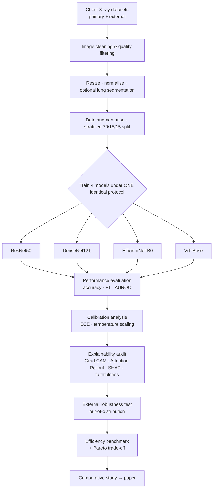

<h1 align="center">Trustworthy Deep Learning for Chest X-ray Disease Detection</h1>

<p align="center">
  <b>Benchmarking the Robustness, Explainability & Calibration of CNNs and Vision Transformers under Dataset Shortcut Bias</b>
</p>

<p align="center">
  <i>A comparative study that goes beyond accuracy — asking not only which model is most accurate, but which is most <b>trustworthy</b> when the data itself is biased.</i>
</p>

<p align="center">
  
  
  
  
  
  
</p>

---

## 📌 Overview

Chest X-ray (CXR) is the most common medical imaging exam in the world, and deep-learning models can now classify chest diseases with reported accuracies above 95%. **But high accuracy is often misleading.** A large body of research shows these models frequently succeed by exploiting hidden dataset artefacts — such as which hospital or scanner produced an image — rather than by reading the lungs. When such models are tested on data from a new hospital, their performance collapses. This is called **shortcut learning**, and it is the single biggest obstacle to deploying CXR AI in real clinics.

This project delivers a rigorous, reproducible comparison of four transfer-learning architectures — three CNNs (**ResNet50**, **DenseNet121**, **EfficientNet-B0**) and one Vision Transformer (**ViT-Base**) — evaluated under a single unified protocol. Crucially, models are ranked by **trustworthiness**, not accuracy alone, across **five axes**:

| Axis | Question it answers |
|------|--------------------|
| 🎯 **Accuracy** | Which model classifies best in-distribution? |
| 📏 **Calibration** | Does the model *know when it is uncertain*? |
| 🔍 **Explainability / Faithfulness** | Do explanations point at the diseased lung, or at artefacts? |
| 🛡️ **Robustness (OOD)** | Does it generalise to an unseen external dataset? |
| ⚡ **Efficiency** | Is it deployable (params, FLOPs, latency, memory)? |

> We do not propose a new architecture. **The contribution is the synthesis** — a unified benchmark across all five axes, using explainability as an *audit tool* to expose shortcut learning on the popular COVID-19 Radiography dataset.

---

## 🧭 Motivation & Research Gap

Our literature review (2023–2026) found that:

- **Plain CNN-vs-ViT accuracy comparisons are saturated** — dozens of recent papers already do this, and reviewers treat it as incremental.
- **Single-property studies exist in isolation** — separate papers on Grad-CAM, on calibration, on efficiency — but rarely together under one controlled protocol.
- **The popular mixed COVID-19 CXR datasets suffer from documented source bias** — because classes were collected from different hospitals, models learn the *source* instead of the *disease*. Internal AUCs above 0.99 have been shown to fall to ~0.76 on external data.

**The gap we exploit:** No existing study systematically compares CNNs and Vision Transformers across accuracy **+** calibration **+** explanation faithfulness **+** efficiency **+** cross-dataset robustness under one identical protocol — and even fewer use explainability to *quantify* shortcut learning. It is also unknown whether a Vision Transformer's global-attention bias makes it **more or less** prone to shortcut learning than convolutional models.

---

## ✨ Key Contributions

1. A **unified, open-source benchmark** comparing three CNNs and a Vision Transformer under identical preprocessing and training on chest X-rays.
2. The first **five-axis trustworthiness comparison** of these architectures (accuracy, calibration, explanation faithfulness, efficiency, cross-dataset robustness) together.
3. Use of explainability (**Grad-CAM / attention rollout / SHAP**) as a **quantitative audit for shortcut learning**, via a lung-localisation faithfulness score.
4. Evidence on whether **ViT's global attention** helps or hurts out-of-distribution robustness vs CNNs.
5. **Practical, reproducible deployment recommendations** depending on whether the priority is accuracy, trust, or compute budget.

---

## 🗂️ Datasets

| Dataset | Content | Role | Link |
|---------|---------|------|------|
| **COVID-19 Radiography Database** | 4 classes (COVID, Normal, Lung Opacity, Viral Pneumonia), ~21k images | **Primary** — train / val / test | [Kaggle](https://www.kaggle.com/datasets/tawsifurrahman/covid19-radiography-database) |
| **RSNA Pneumonia Detection Challenge** | ~26.7k frontal CXRs (DICOM) | **External** — out-of-distribution robustness test *(never trained on)* | [Kaggle](https://www.kaggle.com/c/rsna-pneumonia-detection-challenge/data) |
| *NIH ChestX-ray14* | >100k images, 14 labels | *Optional* generalisation check | *(if time permits)* |

> ⚠️ The primary dataset is known to contain **source bias** — which is precisely what this study investigates, rather than ignores.

**Download (Kaggle API):**
```bash
pip install kaggle
# place kaggle.json (API token) in ~/.kaggle/
kaggle datasets download -d tawsifurrahman/covid19-radiography-database -p data/raw
kaggle competitions download -c rsna-pneumonia-detection-challenge -p data/external
```

---

## 🧠 Models

All four architectures load from [`timm`](https://github.com/huggingface/pytorch-image-models) with ImageNet-pretrained weights:

| Model | Family | ~Params | Role |
|-------|--------|---------|------|
| **ResNet50** | CNN (residual) | 25.6 M | Stable universal baseline |
| **DenseNet121** | CNN (dense) | 8.0 M | Strong medical-imaging baseline |
| **EfficientNet-B0** | CNN (scaled) | 5.3 M | Smallest / fastest; deployment candidate |
| **ViT-Base/16** | Vision Transformer | 86 M | Global attention; CNN-vs-Transformer contrast |

```python
import timm
model = timm.create_model("vit_base_patch16_224", pretrained=True, num_classes=4)
```

> DeiT / ViT-Small are documented fallbacks if ViT-Base over-fits on the smaller dataset.

---

## 🔬 Methodology



**Transfer-learning strategy (identical for every model):** Phase 1 — freeze backbone, train head. Phase 2 — unfreeze final blocks, fine-tune. Shared optimiser (AdamW), schedule, seed and augmentation, so any difference is attributable to the *architecture*, not tuning luck.

**Golden rule:** Freeze one identical preprocessing + training pipeline early and use it for every model. **Fair comparison is the entire point of the study.**

---

## 📊 Evaluation Metrics

- **Classification:** Accuracy, Precision, Recall, F1, ROC-AUC (per-class + macro), confusion matrix
- **Calibration:** Expected Calibration Error (ECE), Brier score, reliability diagrams (pre/post temperature scaling)
- **Explainability:** heatmaps + a quantitative **lung-localisation faithfulness score** + cross-method agreement
- **Robustness:** internal-vs-external accuracy & AUROC drop (generalisation gap)
- **Efficiency:** parameters, FLOPs, model size, inference time (CPU/GPU), peak GPU memory

---

## 📁 Repository Structure

```
Chest-X-ray-Disease-Detection/
├── Project Documents/       # Proposal, work-division plan, task tracker (docx/pdf/xlsx)
├── data/
│   ├── raw/                 # Primary dataset (untouched)
│   ├── processed/           # Cleaned, resized, split + saved indices
│   └── external/            # External RSNA set for OOD testing
├── src/                     # Shared code: preprocessing, dataloaders,
│                            # training template, calibration, XAI, efficiency, eval
├── notebooks/               # Exploratory analysis & per-model experiments
├── models/checkpoints/      # Saved weights (frozen + fine-tuned)
├── results/
│   ├── tables/              # Metric tables (accuracy, calibration, robustness, efficiency)
│   └── figures/             # Curves, reliability diagrams, heatmaps, Pareto
├── explainability/          # Grad-CAM / attention-rollout / SHAP outputs + faithfulness
├── paper/                   # Manuscript drafts & references
└── presentation/            # Slide deck
```

---

## ⚙️ Installation

```bash
git clone https://github.com/<your-username>/Chest-X-ray-Disease-Detection.git
cd Chest-X-ray-Disease-Detection
python -m venv .venv && source .venv/bin/activate      # or use Colab / Kaggle GPU
pip install -r requirements.txt
```

**Core dependencies:** `torch`, `torchvision`, `timm`, `scikit-learn`, `grad-cam`, `shap`, `matplotlib`, `seaborn`, `pandas`, `numpy`. Experiment tracking via `wandb` or `tensorboard`.

---

## ▶️ Usage *(planned interface)*

```bash
# 1. Preprocess & split
python src/preprocess.py --config configs/base.yaml

# 2. Train a model (frozen -> fine-tune)
python src/train.py --model resnet50 --phase all

# 3. Calibrate
python src/calibrate.py --model resnet50

# 4. Explainability + faithfulness
python src/explain.py --model resnet50 --method gradcam

# 5. External robustness test
python src/external_eval.py --model resnet50 --data data/external

# 6. Efficiency benchmark
python src/efficiency.py --model resnet50
```

---

## 📈 Results

> Results will be populated after training. Placeholder for the master comparison table.

| Model | Accuracy | F1 (macro) | AUROC | ECE ↓ | Faithfulness ↑ | OOD Δ ↓ | Params | Latency |
|-------|----------|-----------|-------|-------|----------------|---------|--------|---------|
| ResNet50 | – | – | – | – | – | – | 25.6 M | – |
| DenseNet121 | – | – | – | – | – | – | 8.0 M | – |
| EfficientNet-B0 | – | – | – | – | – | – | 5.3 M | – |
| ViT-Base/16 | – | – | – | – | – | – | 86 M | – |

---

## 👥 Team

A five-member team where **everyone owns one deep-learning model end-to-end** (data → train → calibrate → explain → robustness → efficiency), plus one shared standard and paper sections.

| Member | DNN model | Shared lead role | Paper sections |
|--------|-----------|------------------|----------------|
| **M1** | ResNet50 | Repo, tracking, reproducibility, references | Intro, Related Work, Gap, Conclusion |
| **M2** | DenseNet121 | Data pipeline (preprocess / augment / split / loaders) | Methodology |
| **M3** | EfficientNet-B0 | Efficiency harness, Pareto, compute | Slides |
| **M4** | ViT-Base | Explainability standard + figures | Discussion |
| **M5** | U-Net segmentation | Calibration + robustness protocol, external data, stats | Results, assembly |

---

## 🗓️ Milestones

`M0` Foundations (end W1) → `M1` All models trained (end W2) → `M2` Trust experiments (mid W3) → `M3` Robustness & efficiency (end W3) → `M4` Camera-ready paper & slides (end W4).

---

## 🛠️ Tools & Frameworks

`Python` · `PyTorch` · `timm` / `torchvision` · `pytorch-grad-cam` · `SHAP` · `Matplotlib` / `Seaborn` · `Weights & Biases` / `TensorBoard` · `Git` · `Colab` / `Kaggle GPU`

---

## 🚧 Roadmap

- [ ] Freeze shared data pipeline + baseline (M0)
- [ ] Train all four classification models (M1)
- [ ] Calibration + explainability + faithfulness (M2)
- [ ] External robustness + efficiency benchmark (M3)
- [ ] Consolidated analysis, Pareto, paper & slides (M4)
- [ ] Optional: NIH ChestX-ray14 generalisation check

---

## 📚 Citation

```bibtex
@misc{chestxray_trustworthy_dnn_2026,
  title  = {Trustworthy Deep Learning for Chest X-ray Disease Detection:
            Benchmarking the Robustness, Explainability and Calibration of
            CNNs and Vision Transformers under Dataset Shortcut Bias},
  author = {<Team Members>},
  year   = {2026},
  note   = {Comparative benchmarking study}
}
```

---

## 📄 License

Released under the **MIT License** — see `LICENSE`. *(Dataset licenses belong to their respective providers; review Kaggle terms before redistribution.)*

## 🙏 Acknowledgements

COVID-19 Radiography Database (Kaggle) · RSNA Pneumonia Detection Challenge · the `timm` library · and the open-source medical-imaging research community whose work on shortcut learning motivated this study.
