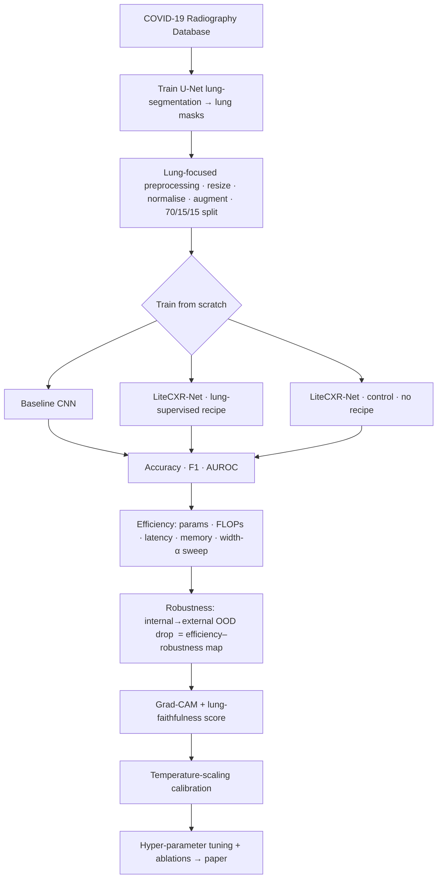

<h1 align="center">Does Efficiency Cost Robustness?</h1>

<p align="center">
  <b>LiteCXR-Net — a Lung-Supervised, Explainable, From-Scratch CNN for Chest X-ray Screening</b>
</p>

<p align="center">
  <i>Investigating the efficiency–robustness–faithfulness trade-off in compact chest X-ray models — and using lung-region supervision to break it — for deployment in low-resource clinics.</i>
</p>

<p align="center">
  
  
  
  
  
  
  
</p>

> **Course:** CS3631 – Deep Neural Networks (2026) · **Team size:** 5 · **Objective:** optimize a DNN (§3-3) — efficient, robust, explainable.

---

## 📌 Overview

Automated chest X-ray (CXR) screening is most needed in **low-resource clinics** running on modest hardware — yet the most accurate models are large, slow, and often **untrustworthy**: they exploit **shortcut learning**, keying on source-hospital or scanner artefacts instead of lung pathology, so their accuracy collapses on data from a new hospital.

Shrinking a model for deployment raises an unanswered question:

> **Does compressing a chest X-ray model make shortcut learning better or worse — and can lung-region supervision break the efficiency-vs-robustness trade-off?**

This project answers that question and acts on it. We train everything **from scratch (no pretrained weights)**, quantify the trade-off, and propose **LiteCXR-Net** — a compact CNN trained with explicit **lung-region supervision** that stays accurate and small while being robust to source shortcuts and anatomically faithful.

---

## 🧭 Research Gap & Hypotheses

Three gaps define the opportunity:

- **Efficient CXR models almost always start from large pretrained backbones**, importing ImageNet biases and hiding a small model's true behaviour. Genuinely *from-scratch* compact CXR models are under-studied.
- **The efficiency–robustness interaction is unresolved.** Two opposing hypotheses coexist and neither has been tested on CXR: (a) lower-capacity models latch onto the easiest, most spurious cues → compression *hurts* robustness; (b) compression acts as a regulariser → smaller models are *more* robust.
- **Faithfulness is rarely quantified**, and never linked to the efficiency/robustness trade-off.

| Hypothesis | Statement |
|---|---|
| **H1 — the trade-off** | Naively compressed from-scratch CNNs suffer a *larger* internal→external (OOD) accuracy drop than a larger baseline — efficiency, obtained naively, worsens shortcut reliance. |
| **H2 — the lever** | Training a compact model with explicit lung-region supervision (LiteCXR-Net) *reduces* the OOD drop and *raises* the lung-faithfulness score at similar/lower cost — breaking the trade-off. |

---

## ✨ Contributions

1. **C1 — Scientific finding:** the first systematic map of the **efficiency–robustness–faithfulness trade-off** for from-scratch CXR CNNs.
2. **C2 — LiteCXR-Net:** a compact architecture + **lung-supervised training recipe** that breaks the trade-off (architecture + learning-strategy novelty).
3. **C3 — Faithfulness framework:** a **lung-localisation faithfulness score**, evaluated with a **causal recipe-vs-control ablation**.
4. **C4 — Reproducible artefact:** an open, from-scratch model + protocol that runs on **free hardware**, with deployment guidance.

---

## 🗂️ Dataset

| Dataset | Content | Role |
|---------|---------|------|
| **COVID-19 Radiography Database** ([Kaggle](https://www.kaggle.com/datasets/tawsifurrahman/covid19-radiography-database)) | 4 classes (COVID, Normal, Lung Opacity, Viral Pneumonia), ~21k images | **Primary** — train / val / test |
| **RSNA Pneumonia Detection Challenge** ([Kaggle](https://www.kaggle.com/c/rsna-pneumonia-detection-challenge/data)) | ~26.7k frontal CXRs | **External** — out-of-distribution robustness test *(never trained on)* |

> The primary dataset's **source bias is an asset here** — it is the very shortcut phenomenon the recipe targets. Compliant with course rule §2.2 (Kaggle datasets).

```bash
pip install kaggle
# place kaggle.json (API token) in ~/.kaggle/
kaggle datasets download -d tawsifurrahman/covid19-radiography-database -p data/raw
kaggle competitions download -c rsna-pneumonia-detection-challenge -p data/external
```

---

## 🧠 Models (all trained from scratch — no pretrained weights)

| Model | Role | Notes |
|-------|------|-------|
| **Baseline CNN** | Mandatory baseline (§4) | Standard from-scratch CNN (ResNet-18-style), reference point |
| **LiteCXR-Net** | Proposed model | Depthwise-separable convs · width multiplier α · lightweight channel-attention · compact head (~0.5–2 M params) |
| **LiteCXR-Net (control)** | Causal ablation | Identical to LiteCXR-Net but trained **without** lung supervision |
| **U-Net** | Lung segmentation | Produces lung masks used for *both* the training recipe and the faithfulness score |

---

## 🔬 Methodology


```mermaid
flowchart TD
    A[COVID-19 Radiography Database] --> U[Train U-Net lung-segmentation → lung masks]
    U --> C[Lung-focused preprocessing · resize · normalise · augment · 70/15/15 split]
    C --> D{Train from scratch}
    D --> B[Baseline CNN]
    D --> L[LiteCXR-Net · lung-supervised recipe]
    D --> K[LiteCXR-Net · control · no recipe]
    B & L & K --> E[Accuracy · F1 · AUROC]
    E --> F[Efficiency: params · FLOPs · latency · memory · width-α sweep]
    F --> G[Robustness: internal→external OOD drop  = efficiency–robustness map]
    G --> H[Grad-CAM + lung-faithfulness score]
    H --> I[Temperature-scaling calibration]
    I --> J[Hyper-parameter tuning + ablations → paper]
```

**Golden rule:** baseline, LiteCXR-Net (recipe) and LiteCXR-Net (control) share the *same* optimiser, schedule, seed and augmentation — so differences are attributable to the **architecture and the lung-supervision recipe**, not to tuning luck.

---

## 📊 Evaluation Metrics

- **Classification:** Accuracy, Precision, Recall, macro-F1, per-class F1, ROC-AUC, confusion matrix
- **Efficiency:** parameters, FLOPs, model size (MB), latency (CPU & GPU), peak memory, training time
- **Robustness:** internal→external accuracy & AUROC drop, **across width α**
- **Faithfulness:** lung-localisation faithfulness score (Grad-CAM ∩ lung mask) + heatmaps
- **Calibration (supporting):** Expected Calibration Error (ECE), reliability diagram

---

## 📁 Repository Structure

```
Chest-X-ray-Disease-Detection/
├── Project Documents/       # Proposal, work-division plan, task tracker
├── data/  raw · processed · external
├── src/                     # preprocess · lung_mask (U-Net) · dataloader · baseline_cnn
│                            # litecxrnet · train · calibrate · gradcam · faithfulness · efficiency · external_eval
├── notebooks/               # EDA & per-experiment notebooks
├── models/checkpoints/      # from-scratch weights (baseline · LiteCXR-Net · control · U-Net)
├── results/  tables · figures
├── explainability/          # Grad-CAM heatmaps + faithfulness outputs
├── paper/                   # manuscript + references
└── presentation/            # slide deck
```

---

## ⚙️ Installation

```bash
git clone https://github.com/<your-username>/Chest-X-ray-Disease-Detection.git
cd Chest-X-ray-Disease-Detection
python -m venv .venv && source .venv/bin/activate      # or use Colab / Kaggle GPU
pip install -r requirements.txt
```

**Core deps:** `torch`, `torchvision`, `numpy`, `scikit-learn`, `opencv-python`, `grad-cam`, `matplotlib`, `seaborn`. Tracking via `wandb` / `tensorboard`. *(No `timm` / no pretrained weights.)*

---

## ▶️ Usage *(planned interface)*

```bash
python src/preprocess.py --config configs/base.yaml     # preprocess + lung masks (U-Net)
python src/train.py --model baseline                    # from-scratch baseline CNN
python src/train.py --model litecxrnet --recipe lung    # proposed (lung-supervised)
python src/train.py --model litecxrnet --recipe none    # control (no supervision)
python src/efficiency.py --model litecxrnet             # params/FLOPs/latency/memory
python src/external_eval.py --model litecxrnet --data data/external   # OOD robustness
python src/gradcam.py --model litecxrnet                # Grad-CAM + faithfulness score
python src/calibrate.py --model litecxrnet              # temperature scaling
```

---

## 📈 Results *(to be populated after training)*

| Model | Accuracy | macro-F1 | Params ↓ | FLOPs ↓ | Latency ↓ | OOD drop ↓ | Faithfulness ↑ | ECE ↓ |
|-------|----------|----------|----------|---------|-----------|------------|----------------|-------|
| Baseline CNN | – | – | – | – | – | – | – | – |
| LiteCXR-Net (recipe) | – | – | – | – | – | – | – | – |
| LiteCXR-Net (control) | – | – | – | – | – | – | – | – |

---

## 👥 Team (each member owns a hands-on ML task — rule §11)

| Member | Hands-on ML task | Paper section |
|--------|------------------|---------------|
| **M1** | Trains & tunes the from-scratch **baseline CNN** | Intro, Related Work, Abstract |
| **M2** | Trains the **U-Net** lung-segmentation model + the **lung-supervised (recipe) model** | Dataset, Experimental Setup |
| **M3** | Designs & trains **LiteCXR-Net** + hyperparameter tuning | Proposed Framework |
| **M4** | Trains & evaluates all **ablation variants** + efficiency benchmark | Experiments (efficiency, ablation) |
| **M5** | Trains the **control model** + fits **temperature-scaling calibration** + robustness/XAI | Results, Discussion, Conclusion |

---

## 🗓️ Milestones

`M0` Baseline & pipeline ready (W1) → `M1` Proposed model trained (W2) → `M2` Efficiency & ablations done (mid-W3) → `M3` Robustness, XAI & calibration done (W3) → `M4` Paper & slides ready (W4).

Official deadlines: **Proposal Aug 2** (2-page ACM) · **Short paper Aug 23** · **Full paper Week 12**.

---

## 🚧 Roadmap

- [ ] Data pipeline + U-Net lung masks (M0)
- [ ] From-scratch baseline CNN + hyperparameter tuning (M0 → M1)
- [ ] LiteCXR-Net (recipe) + control model trained (M1)
- [ ] Efficiency–robustness map (width-α sweep) + ablations (M2)
- [ ] Grad-CAM faithfulness + calibration (M3)
- [ ] Consolidated results, paper & slides (M4)

---

## 📚 Citation

```bibtex
@misc{litecxrnet_2026,
  title  = {Does Efficiency Cost Robustness? A Lung-Supervised, Explainable,
            From-Scratch CNN for Chest X-ray Screening},
  author = {<Team Members>},
  year   = {2026},
  note   = {CS3631 Deep Neural Networks research project}
}
```

## 📄 License

MIT — see `LICENSE`. *(Dataset licences belong to their providers; review Kaggle terms before redistribution.)*

## 🙏 Acknowledgements

COVID-19 Radiography Database · RSNA Pneumonia Detection Challenge · and the shortcut-learning literature (Geirhos et al., DeGrave et al.) that motivated this study.
