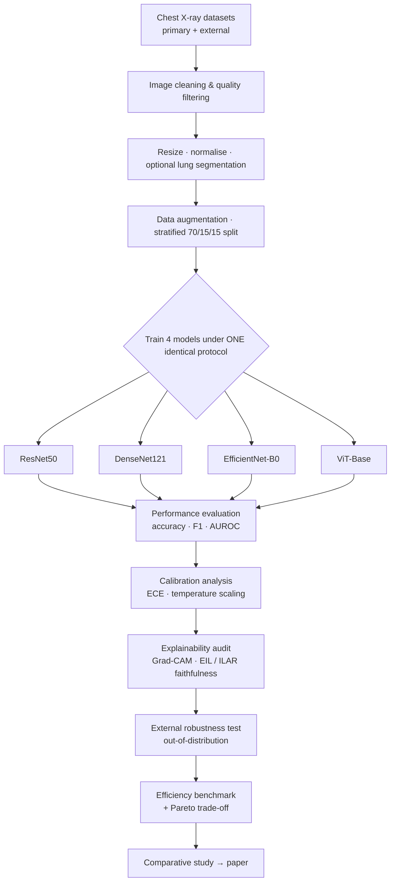

<h1 align="center">Trustworthy Deep Learning for Chest X-ray Disease Detection</h1>

<p align="center">
  <b>Benchmarking the Robustness, Explainability & Calibration of CNNs and Vision Transformers under Dataset Shortcut Bias</b>
</p>

<p align="center">
  <i>A comparative study that goes beyond accuracy — asking not only which model is most accurate, but which is most <b>trustworthy</b> when the data itself is biased.</i>
</p>

<p align="center">
  
  
  
  
  
  
</p>

---

## 📌 Overview

Chest X-ray (CXR) is the most common medical imaging exam in the world, and deep-learning models can now classify chest diseases with reported accuracies above 95%. **But high accuracy is often misleading.** A large body of research shows these models frequently succeed by exploiting hidden dataset artefacts — such as which hospital or scanner produced an image — rather than by reading the lungs. When such models are tested on data from a new hospital, their performance collapses. This is called **shortcut learning**, and it is the single biggest obstacle to deploying CXR AI in real clinics.

This project delivers a rigorous, reproducible comparison of four transfer-learning architectures — three CNNs (**ResNet50**, **DenseNet121**, **EfficientNet-B0**) and one Vision Transformer (**ViT-Base**) — evaluated under a single unified protocol. Crucially, models are ranked by **trustworthiness**, not accuracy alone, across **five axes**:

| Axis | Question it answers |
|------|--------------------|
| 🎯 **Accuracy** | Which model classifies best in-distribution? |
| 📏 **Calibration** | Does the model *know when it is uncertain*? |
| 🔍 **Explainability / Faithfulness** | Do explanations point at the diseased lung, or at artefacts? |
| 🛡️ **Robustness (OOD)** | Does it generalise to an unseen external dataset? |
| ⚡ **Efficiency** | Is it deployable (params, FLOPs, latency, memory)? |

> The project has two threads: **(1)** a unified benchmark across the five axes above, using explainability as an *audit tool* to expose shortcut learning on the popular COVID-19 Radiography dataset; and **(2)** a **proposed Lung-Region Attention module** that acts on that finding — a lightweight, mask-supervised attention gate that measurably relocates a classifier's evidence into the lungs. Thread (2) is currently the furthest advanced (see [Current Status](#-current-status)).

---

## 🧭 Motivation & Research Gap

Our literature review (2023–2026) found that:

- **Plain CNN-vs-ViT accuracy comparisons are saturated** — dozens of recent papers already do this, and reviewers treat it as incremental.
- **Single-property studies exist in isolation** — separate papers on Grad-CAM, on calibration, on efficiency — but rarely together under one controlled protocol.
- **The popular mixed COVID-19 CXR datasets suffer from documented source bias** — because classes were collected from different hospitals, models learn the *source* instead of the *disease*. Internal AUCs above 0.99 have been shown to fall to ~0.76 on external data.

**The gap we exploit:** No existing study systematically compares CNNs and Vision Transformers across accuracy **+** calibration **+** explanation faithfulness **+** efficiency **+** cross-dataset robustness under one identical protocol — and even fewer use explainability to *quantify* shortcut learning. It is also unknown whether a Vision Transformer's global-attention bias makes it **more or less** prone to shortcut learning than convolutional models.

---

## ✨ Key Contributions

1. A **Lung-Region Attention module** — a 131K-parameter (+1.89%), mask-supervised attention gate that raises Grad-CAM evidence-inside-lung by **+7.05 ± 0.86 pp** across three seeds with **no statistically detectable accuracy cost** (McNemar *p* ≥ 0.53), validated by a **controlled six-arm ablation**. ✅ *Done*
2. A **unified, open-source benchmark** comparing three CNNs and a Vision Transformer under identical preprocessing and an identical, verified train/val/test split. ✅ *Accuracy axis done*
3. Use of **Grad-CAM** as a **quantitative audit for shortcut learning**, via a lung-localisation faithfulness score (EIL / ILAR / attention-Dice). ✅ *Done for the module*
4. A **five-axis trustworthiness comparison** (accuracy, calibration, explanation faithfulness, efficiency, cross-dataset robustness). 🚧 *Accuracy + faithfulness done; calibration harness built; efficiency partial; OOD pending*
5. **Practical, reproducible deployment recommendations** depending on whether the priority is accuracy, trust, or compute budget. 🚧 *Pending*

---

## ✅ Current Status

All numbers below are real, committed results on the **same fixed 3,175-image test split** (the notebook split function was verified to reproduce `artifacts/splits/split_manifest_v1.csv` exactly — 21,165/21,165 images).

### Proposed module — Lung-Region Attention (T18)

Six arms, one backbone (DenseNet121), one protocol, one split, seeds 42/123/2026.
Full detail: [`artifacts/T18_lung_attention/T18_module_card.md`](artifacts/T18_lung_attention/T18_module_card.md)

| Arm | Gate | λ | Acc % | Macro-F1 % | Att-Dice | Grad-CAM EIL |
|---|---|---|---|---|---|---|
| **A0** vanilla *(baseline)* | – | 0 | 94.68 | 95.11 | – | 0.296 |
| **A1** gate-only | residual | 0 | 94.52 | 94.97 | 0.080 | 0.284 |
| **A4** guidance-only | none | 1.0 | 94.61 | 94.99 | 0.840 | 0.317 |
| **A2** ✨ **full (proposed)** | residual | 1.0 | **94.65** | **95.08** | **0.839** | **0.374** |
| **A5** CBAM *(published comparator)* | multiply | 0 | 94.39 | 94.76 | 0.415 | – |
| **A3** multiply-gate | multiply | 1.0 | 94.24 | 94.46 | 0.840 | – |

**Headline (A2 vs A0, 3 seeds):** EIL **+7.05 ± 0.86 pp** (paired Wilcoxon *p* < 10⁻¹⁴⁰, 92% of images improve) · macro-F1 **−0.08 pp**, *statistically indistinguishable from zero* (McNemar exact *p* = 1.000 / 0.526 / 0.826) · **+131,329 params (+1.89%)**, +0.22% GFLOPs, CPU latency unchanged.

**Key ablation finding:** mask supervision produces *localisation* (A4: Dice 0.840) but barely moves *evidence* (+2.10 pp EIL); the residual gate converts localisation into evidence (A2: +7.73 pp). **Neither component alone reproduces the result.**

### Stage-1 architecture baselines

| Model | Accuracy | Macro-F1 | Macro AUC | Evidence |
|---|---|---|---|---|
| ResNet50 (vanilla) | 85.70% | 85.44% | 0.9678 | [`notebooks/ResNet50_Baseline.ipynb`](notebooks/ResNet50_Baseline.ipynb) |
| ResNet50 (tuned) | 91.02% | 91.21% | 0.9850 | [`notebooks/ResNet50_hyper-parameter_tunning.ipynb`](notebooks/ResNet50_hyper-parameter_tunning.ipynb) |
| **DenseNet121 (HPO winner)** | **94.83%** | **95.05%** | **0.9928** | [`notebooks/DenseNet_HPO_train.ipynb`](notebooks/DenseNet_HPO_train.ipynb) |
| EfficientNet-B0 | 90.87% | 91.47% | 0.9841 | [`artifacts/efficientnet_b0/`](artifacts/efficientnet_b0/) |
| ViT-Base/16 | 91.91% | 92.25% | 0.9883 | [`artifacts/vit_base/`](artifacts/vit_base/) |

DenseNet121 was selected as the module's host backbone on this evidence.

### Other shortcut-suppression candidates

| Candidate | Approach | Acc % | Macro-F1 % | Note |
|---|---|---|---|---|
| **(a)** Lung-Region Attention | mask-supervised attention gate | 94.65 | 95.08 | ✅ full ablation + 3 seeds |
| **(b)** Auxiliary Segmentation Head | shared encoder, seg decoder (Dice 0.929) | 90.02 | 90.22 | trained under pre-HPO settings |
| **(c)** Grad-CAM Suppression Loss | penalise background feature energy | 95.53 | 95.94 | single-phase full fine-tune |

> ⚠️ Candidates (b) and (c) were trained under **different protocols** from (a), so their accuracy deltas are **not** attributable to the method. A protocol-matched head-to-head (P12 winner selection) is pending.

> **Design (not yet implemented):** the full P12 winner-selection + P13 cross-architecture plan — including the ViT-Base architecture adaptation (ViT's classifier reads only the CLS token by default, which the attention gate can't influence; the plan is to switch to average-pooling over patch tokens so the gate has an actual effect) — is written up in [`Claude Working Files/T22_T23_Cross_Backbone_Shortcut_Suppression.md`](../Claude%20Working%20Files/T22_T23_Cross_Backbone_Shortcut_Suppression.md).

### Lung masks

Every one of the 21,165 images ships with a lung mask. We **independently audited all of them** (coverage statistics, split consistency, image↔mask pairing) — see [`artifacts/segmentation/mask_quality_report.csv`](artifacts/segmentation/mask_quality_report.csv) and [`notebooks/M5_lung_masking_kaggle.ipynb`](notebooks/M5_lung_masking_kaggle.ipynb). **T18 is supervised by these verified dataset masks.** Replacing them with masks from our own segmentation model — so the method transfers to datasets that ship no masks — is planned next.

---

## 🗂️ Datasets

| Dataset | Content | Role | Link |
|---------|---------|------|------|
| **COVID-19 Radiography Database** | 4 classes (COVID, Normal, Lung Opacity, Viral Pneumonia), ~21k images | **Primary** — train / val / test | [Kaggle](https://www.kaggle.com/datasets/tawsifurrahman/covid19-radiography-database) |
| **RSNA Pneumonia Detection Challenge** | ~26.7k frontal CXRs (DICOM) | **External** — out-of-distribution robustness test *(never trained on)* | [Kaggle](https://www.kaggle.com/c/rsna-pneumonia-detection-challenge/data) |
| *NIH ChestX-ray14* | >100k images, 14 labels | *Optional* generalisation check | *(if time permits)* |

> ⚠️ The primary dataset is known to contain **source bias** — which is precisely what this study investigates, rather than ignores.

**Download (Kaggle API):**
```bash
pip install kaggle
# place kaggle.json (API token) in ~/.kaggle/
kaggle datasets download -d tawsifurrahman/covid19-radiography-database -p data/raw
kaggle competitions download -c rsna-pneumonia-detection-challenge -p data/external
```

---

## 🧠 Models

All four architectures load from [`timm`](https://github.com/huggingface/pytorch-image-models) with ImageNet-pretrained weights:

| Model | Family | ~Params | Role |
|-------|--------|---------|------|
| **ResNet50** | CNN (residual) | 25.6 M | Stable universal baseline |
| **DenseNet121** | CNN (dense) | 8.0 M | Strong medical-imaging baseline |
| **EfficientNet-B0** | CNN (scaled) | 5.3 M | Smallest / fastest; deployment candidate |
| **ViT-Base/16** | Vision Transformer | 86 M | Global attention; CNN-vs-Transformer contrast |

```python
import timm
model = timm.create_model("vit_base_patch16_224", pretrained=True, num_classes=4)
```

> DeiT / ViT-Small are documented fallbacks if ViT-Base over-fits on the smaller dataset.

---

## 🔬 Methodology


```mermaid
flowchart TD
    A[Chest X-ray datasets<br/>primary + external] --> B[Image cleaning & quality filtering]
    B --> C[Resize · normalise · optional lung segmentation]
    C --> D[Data augmentation · stratified 70/15/15 split]
    D --> E{Train 4 models under ONE identical protocol}
    E --> M1[ResNet50]
    E --> M2[DenseNet121]
    E --> M3[EfficientNet-B0]
    E --> M4[ViT-Base]
    M1 & M2 & M3 & M4 --> F[Performance evaluation<br/>accuracy · F1 · AUROC]
    F --> G[Calibration analysis<br/>ECE · temperature scaling]
    G --> H[Explainability audit<br/>Grad-CAM · EIL / ILAR faithfulness]
    H --> I[External robustness test<br/>out-of-distribution]
    I --> J[Efficiency benchmark<br/>+ Pareto trade-off]
    J --> K[Comparative study → paper]
```

**Transfer-learning strategy (identical for every model):** Phase 1 — freeze backbone, train head. Phase 2 — unfreeze final blocks, fine-tune. Shared optimiser (AdamW), schedule, seed and augmentation, so any difference is attributable to the *architecture*, not tuning luck.

**Golden rule:** Freeze one identical preprocessing + training pipeline early and use it for every model. **Fair comparison is the entire point of the study.**

---

## 📊 Evaluation Metrics

- **Classification:** Accuracy, Precision, Recall, F1, ROC-AUC (per-class + macro), confusion matrix, **McNemar's exact test** on paired per-image correctness ✅
- **Explainability / faithfulness:** Grad-CAM **evidence-inside-lung (EIL)** at pre- and post-gate taps, **inside-lung attention ratio (ILAR)**, attention-mask **Dice/IoU**, **Wilcoxon signed-rank** test on paired per-image EIL ✅
- **Efficiency:** parameters, FLOPs (`fvcore`), model size, CPU/GPU inference latency ✅ *(module measured; cross-architecture table partial)*
- **Calibration:** Expected Calibration Error (ECE), Brier score, reliability diagrams, temperature scaling — 🚧 *harness implemented + tested (`src/modules/calibration.py`), not yet run on checkpoints*
- **Robustness:** background-perturbation counterfactual stability (`src/modules/counterfactual.py`, implemented + tested) and internal-vs-external AUROC drop on RSNA — 🚧 *pending*

---

## 📁 Repository Structure

```
Chest-X-ray-Disease-Detection/
├── Project Documents/     # Proposal, work-division plan, task tracker
├── src/
│   ├── datasets/          # mask-aware CXR pipeline, JointTransform, manifest loader
│   ├── modules/           # ⭐ the proposed module + evaluation machinery:
│   │                      #   lung_attention · attention_metrics · gradcam
│   │                      #   training · comparison · counterfactual · calibration
│   └── utils/             # config · seeding · W&B tracking · checkpointing
├── notebooks/             # per-architecture training (run on Kaggle/Colab GPU)
├── configs/               # YAML experiment configs
├── artifacts/             # ⭐ committed run outputs (results, figures, split manifest)
│   ├── splits/            #   fixed train/val/test manifest
│   ├── T18_lung_attention/#   proposed module: 6 arms, 3 seeds, figures, module card
│   ├── {vit_base, efficientnet_b0, densenet121_auxseg, candidate_c_suppression}/
│   └── segmentation/      #   lung-mask verification report
├── tests/                 # 160 tests (pytest, run in CI)
└── docs/                  # experiment policy, W&B setup, paper draft
```

> `data/` (dataset) and `*.pt` checkpoints are gitignored; `artifacts/` holds the small,
> committed result files needed to reproduce every number in this README.

---

## ⚙️ Installation

```bash
git clone https://github.com/<your-username>/Chest-X-ray-Disease-Detection.git
cd Chest-X-ray-Disease-Detection
python -m venv .venv && source .venv/bin/activate      # or use Colab / Kaggle GPU
pip install -r requirements.txt
```

**Core dependencies:** `torch`, `torchvision`, `timm`, `scikit-learn`, `grad-cam`, `fvcore`, `matplotlib`, `pandas`, `numpy`, `pytest`. Experiment tracking via `wandb`.

> `requirements.txt` deliberately excludes `torch`/`torchvision` — Kaggle and Colab ship a GPU-matched build, and installing over it risks a CPU-only or version-mismatched wheel.

---

## 🧪 Experiment Tracking

Every training run — regardless of who trains it or which model — follows the same standard:

| Layer | Tool |
|-------|------|
| **Training environment** | Kaggle / Google Colab (GPU) |
| **Experiment tracking** | Weights & Biases |
| **Configuration** | [`configs/*.yaml`](configs/) |
| **Reproducibility policy** | [`docs/experiment_policy.md`](docs/experiment_policy.md) |
| **W&B setup guide** | [`docs/wandb_setup.md`](docs/wandb_setup.md) |

GitHub stores the code, config, and policy needed to reproduce a run; W&B stores that run's metrics and history. Start from [`notebooks/kaggle_training_template.ipynb`](notebooks/kaggle_training_template.ipynb) or [`notebooks/colab_training_template.ipynb`](notebooks/colab_training_template.ipynb) and the shared utilities in [`src/utils/`](src/utils/).

---

## ▶️ Usage

Training runs in notebooks on a Kaggle/Colab GPU; the reusable module, training loop and
evaluation harness live in `src/` so every notebook imports the *same* code.

```bash
# Run the test suite (160 tests, ~45 s, CPU-only)
pytest
pytest tests/test_lung_attention.py -v        # a single file
```

```python
# The proposed module — any timm backbone, mask-free at inference
from src.modules import build_model, compute_total_loss, run_full_arm

model = build_model(backbone_name="densenet121", use_attention=True,
                    gate_mode="residual", reduction=8, drop_rate=0.4303)
logits, attention, attention_logits = model(images)   # 3-tuple
```

| To reproduce | Notebook |
|---|---|
| Proposed module, all six arms | [`notebooks/T18_lung_region_attention.ipynb`](notebooks/T18_lung_region_attention.ipynb) |
| DenseNet121 HPO (Optuna, 20 trials) | [`notebooks/DenseNet_HPO_train.ipynb`](notebooks/DenseNet_HPO_train.ipynb) |
| ResNet50 baseline / tuning | [`notebooks/ResNet50_Baseline.ipynb`](notebooks/ResNet50_Baseline.ipynb) · [`ResNet50_hyper-parameter_tunning.ipynb`](notebooks/ResNet50_hyper-parameter_tunning.ipynb) |
| EfficientNet-B0 · ViT-Base | [`efficientnet-b0-baseline-model.ipynb`](notebooks/efficientnet-b0-baseline-model.ipynb) · [`ViT_Base_Baseline.ipynb`](notebooks/ViT_Base_Baseline.ipynb) |
| Candidates (b) and (c) | [`baseline-cnn-model-dnn-research-auxseg-updated.ipynb`](notebooks/baseline-cnn-model-dnn-research-auxseg-updated.ipynb) · [`candidate-c-grad-cam-shortcut-suppression-loss.ipynb`](notebooks/candidate-c-grad-cam-shortcut-suppression-loss.ipynb) |
| Lung-mask verification | [`notebooks/M5_lung_masking_kaggle.ipynb`](notebooks/M5_lung_masking_kaggle.ipynb) |

---

## 📈 Results

Master comparison — same fixed test split (*n* = 3,175) for every row.
Faithfulness = Grad-CAM evidence-inside-lung (EIL). ECE and OOD Δ are pending.

| Model | Accuracy | F1 (macro) | AUROC | Faithfulness ↑ | ECE ↓ | OOD Δ ↓ | Params |
|-------|----------|-----------|-------|----------------|-------|---------|--------|
| ResNet50 (tuned) | 91.02% | 91.21% | 0.9850 | – | pending | pending | 25.6 M |
| DenseNet121 (HPO) | 94.83% | 95.05% | 0.9928 | – | pending | pending | 7.0 M |
| DenseNet121 **A0** *(module baseline)* | 94.68% | 95.11% | 0.9932 | 0.296 | pending | pending | 7.0 M |
| DenseNet121 **+ Lung-Region Attention (A2)** ✨ | **94.65%** | **95.08%** | 0.9929 | **0.374** | pending | pending | **7.1 M** |
| EfficientNet-B0 | 90.87% | 91.47% | 0.9841 | – | pending | pending | 4.0 M |
| ViT-Base/16 | 91.91% | 92.25% | 0.9883 | – | pending | pending | 86 M |

The proposed module trades **−0.03 pp macro-F1** (not statistically distinguishable from zero)
for **+7.7 pp evidence-inside-lung**, at **+1.89% parameters** and **+0.22% GFLOPs**.

---

## 👥 Team

A five-member team where **everyone owns one deep-learning model end-to-end** (data → train → calibrate → explain → robustness → efficiency), plus one shared standard and paper sections.

| Member | DNN model | Shared lead role | Paper sections |
|--------|-----------|------------------|----------------|
| **M1** | ResNet50 | Repo, tracking, reproducibility, references | Intro, Related Work, Gap, Conclusion |
| **M2** | DenseNet121 | Data pipeline (preprocess / augment / split / loaders) | Methodology |
| **M3** | EfficientNet-B0 | Efficiency harness, Pareto, compute | Slides |
| **M4** | ViT-Base | Explainability standard + figures | Discussion |
| **M5** | Lung-mask verification & segmentation | Calibration + robustness protocol, external data, stats | Results, assembly |

---

## 🗓️ Milestones

`M0` Foundations (end W1) → `M1` All models trained (end W2) → `M2` Trust experiments (mid W3) → `M3` Robustness & efficiency (end W3) → `M4` Camera-ready paper & slides (end W4).

---

## 🛠️ Tools & Frameworks

`Python` · `PyTorch` · `timm` / `torchvision` · `pytorch-grad-cam` · `fvcore` · `Optuna` · `Matplotlib` · `Weights & Biases` · `pytest` / GitHub Actions · `Git` · `Colab` / `Kaggle GPU`

---

## 🚧 Roadmap

- [x] Freeze shared data pipeline + fixed split manifest + lung-mask verification (M0)
- [x] Train all four classification models under the shared protocol (M1)
- [x] **Propose, implement and ablate the Lung-Region Attention module** — 6 arms, 3 seeds, significance-tested (M2)
- [x] Explainability + faithfulness (Grad-CAM EIL / ILAR / attention-Dice) for the module (M2)
- [x] Efficiency benchmark for the module (params / FLOPs / latency) (M3)
- [ ] Run the counterfactual background-perturbation robustness test on trained checkpoints
- [x] Run the background-suppression loss follow-up (new arm "A2_bg", `lambda_bg > 0`) — notebook ready: [`notebooks/T18_A2bg_background_suppression_followup.ipynb`](notebooks/T18_A2bg_background_suppression_followup.ipynb), not yet executed — result: ILAR up, but Grad-CAM EIL 0.374→0.359 (not an improvement); see module card §10
- [ ] Calibration (ECE / Brier / temperature scaling) across models
- [ ] Train our own lung-segmentation model and re-run T18 with self-generated masks
- [ ] Protocol-matched comparison of candidates (a) / (b) / (c), then winner selection
- [ ] Transfer the winning module to ResNet50, EfficientNet-B0 and ViT-Base — full design in [`Claude Working Files/T22_T23_Cross_Backbone_Shortcut_Suppression.md`](../Claude%20Working%20Files/T22_T23_Cross_Backbone_Shortcut_Suppression.md) (ViT needs an architecture adaptation, not just a config copy)
- [ ] External RSNA robustness + consolidated Pareto analysis (M3–M4)
- [ ] Optional: NIH ChestX-ray14 generalisation check

---

## 📚 Citation

```bibtex
@misc{chestxray_trustworthy_dnn_2026,
  title  = {Trustworthy Deep Learning for Chest X-ray Disease Detection:
            Benchmarking the Robustness, Explainability and Calibration of
            CNNs and Vision Transformers under Dataset Shortcut Bias},
  author = {<Team Members>},
  year   = {2026},
  note   = {Comparative benchmarking study}
}
```

---

## 📄 License

Released under the **MIT License** — see `LICENSE`. *(Dataset licenses belong to their respective providers; review Kaggle terms before redistribution.)*

## 🙏 Acknowledgements

COVID-19 Radiography Database (Kaggle) · RSNA Pneumonia Detection Challenge · the `timm` library · and the open-source medical-imaging research community whose work on shortcut learning motivated this study.
